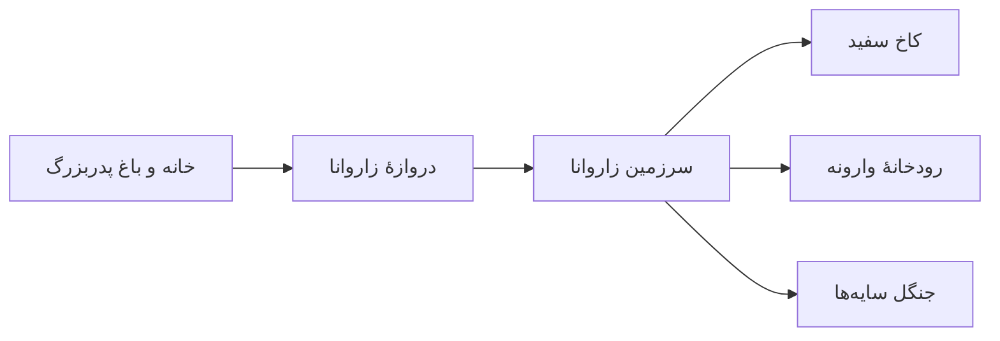

# دروازهٔ زاروانا

- **دسته‌بندی:** گذرگاه‌ها و درگاه‌ها
- **وضعیت:** فعال در لحظات نیاز قهرمانان
- **نگهبانان:** بندیار و مهیار به عنوان راهنمایان دارا

## توصیف کلی
دروازه‌ای عظیم و افسانه‌ای که با بشکن بندیار ظاهر می‌شود و دارا را از جهان عادی به سرزمین زاروانا منتقل می‌کند. معماری آن یادآور ستون‌های تخت‌جمشید است؛ ترکیبی از سنگ‌های حکاکی‌شده، نقش حیوانات اساطیری و تزئینات طلایی که زیر نور ماورایی می‌درخشند.

## ویژگی‌های بصری و محیطی
- ستون‌های سنگی بلند با نقش‌ر Relief موجودات افسانه‌ای.
- تزئینات طلا و نقره که در تاریکی نور خود را تولید می‌کنند.
- درگاهی نیمه‌شفاف که هنگام فعال شدن، باد و نور رنگین جاری می‌شود.

## رویدادهای کلیدی
- نخستین انتقال دارا از باغ پدربزرگ به جهان زاروانا.
- آغاز سفر دارا برای ملاقات با کیخسرو و دریافت پاسخ‌های سرنوشت.

## موجودات و شخصیت‌های مرتبط
- بندیار و مهیار (راهنمایان و فعال‌کنندگان دروازه).
- دارا به عنوان مسافر اصلی.

## نمودار مسیر عبور

این نمودار مسیرهای اصلی را که از طریق دروازه به سرزمین زاروانا متصل می‌شوند، ترسیم می‌کند.

## پیوندها و ارجاعات
- گذرگاه بین [باغ پدربزرگ](./باغ%20پدربزرگ.md) و [زاروانا](./زاروانا.md).
